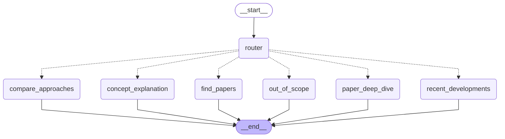

# AI Research Navigator — Agent Graph

Auto-generated by `research_navigator.agents.graph.save_graph_visualization`.

```mermaid
---
config:
  flowchart:
    curve: linear
---
graph TD;
	__start__([<p>__start__</p>]):::first
	router(router)
	concept_explanation(concept_explanation)
	paper_deep_dive(paper_deep_dive)
	compare_approaches(compare_approaches)
	recent_developments(recent_developments)
	find_papers(find_papers)
	out_of_scope(out_of_scope)
	__end__([<p>__end__</p>]):::last
	__start__ --> router;
	router -.-> compare_approaches;
	router -.-> concept_explanation;
	router -.-> find_papers;
	router -.-> out_of_scope;
	router -.-> paper_deep_dive;
	router -.-> recent_developments;
	compare_approaches --> __end__;
	concept_explanation --> __end__;
	find_papers --> __end__;
	out_of_scope --> __end__;
	paper_deep_dive --> __end__;
	recent_developments --> __end__;
	classDef default fill:#f2f0ff,line-height:1.2
	classDef first fill-opacity:0
	classDef last fill:#bfb6fc

```
